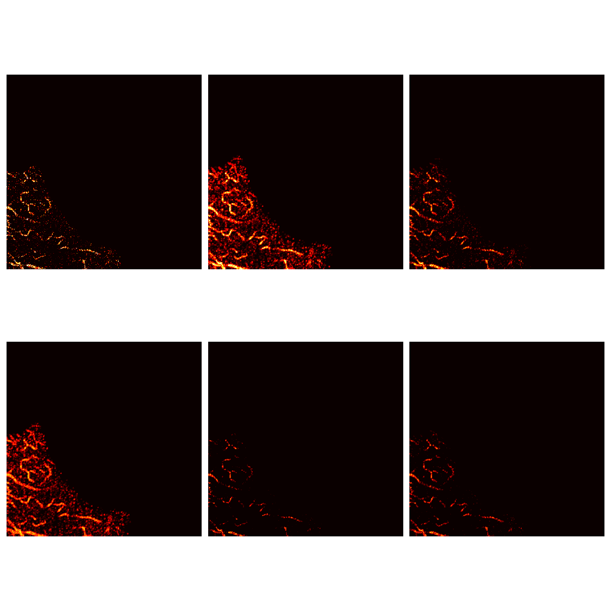
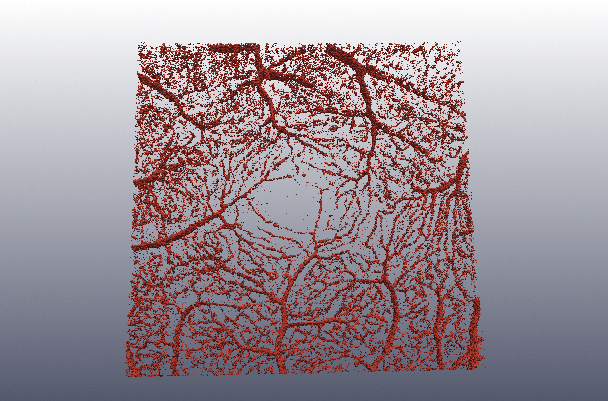
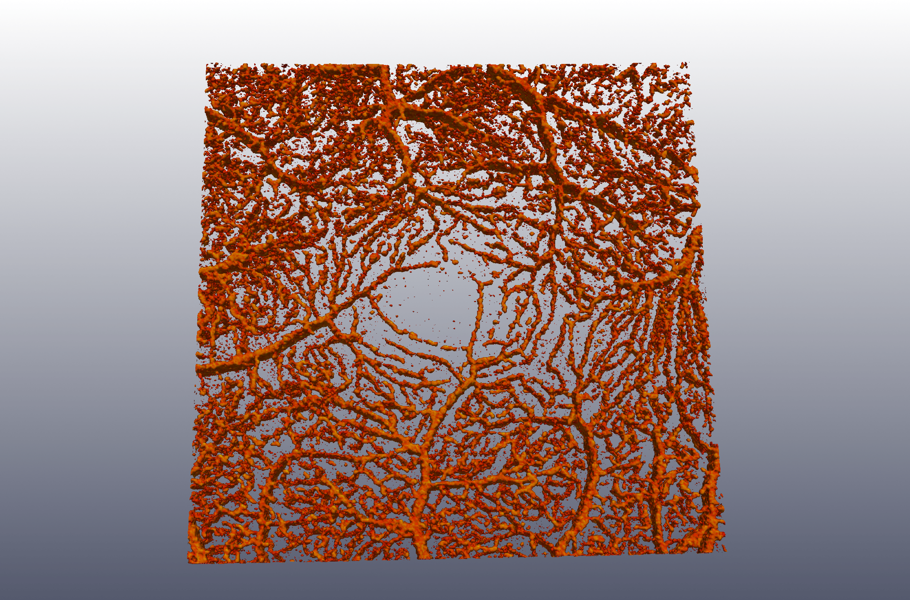
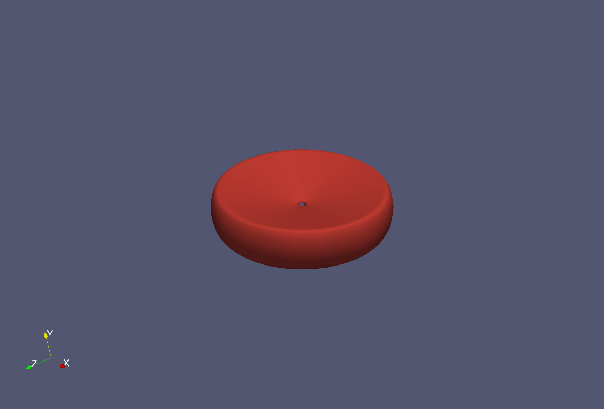
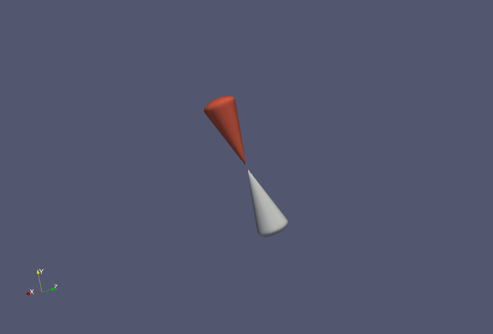
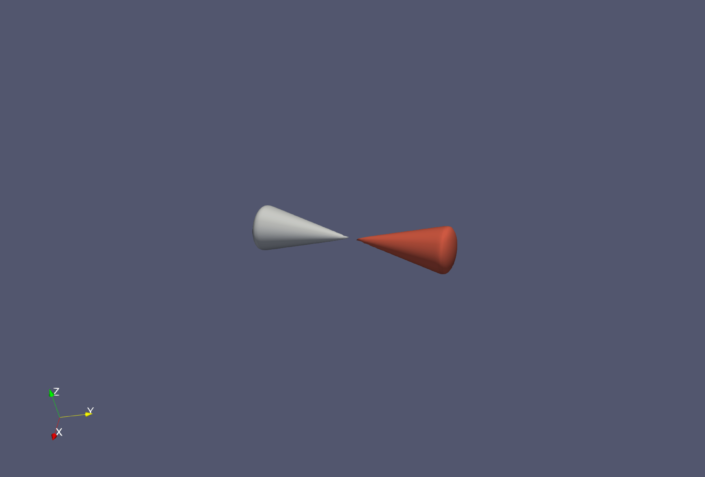
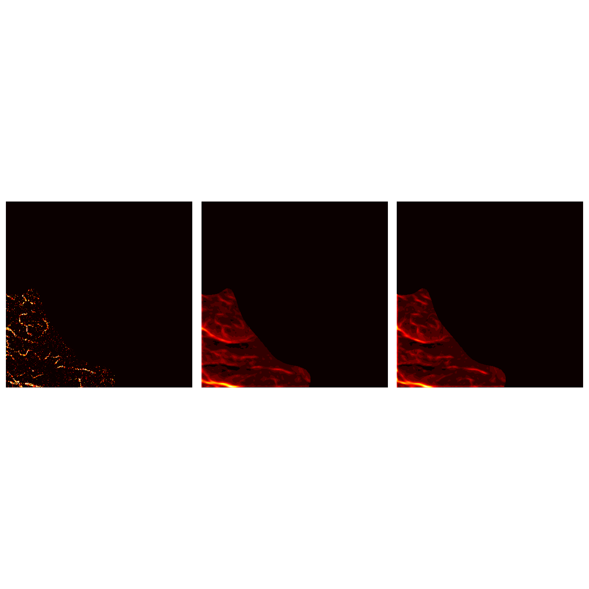

# Vascular Enhancement Toolbox

Vascular Enhancement is a Python/Cython toolbox with GPU-accelerated convolution routines for preprocessing vascular and tubular structures in noisy 3D images. The toolbox is designed to enhance and complete vascular data, particularly for OCTA (optical coherence tomography angiography) imaging, including handling noisy and corrupted datasets. The toolbox implements the following algorithms:

## 3D Orientation Field Transform (OFT)

The **3D Orientation Field Transform (OFT)** algorithm is based on research that adapts the 3D OFT as an effective solution for enhancing tubular structures in both synthetic and real-world datasets, including transmission electron microscopy (TEM) tomograms. This method processes noisy and corrupted data by transforming it with the following three key features:

### Line Integral Operator

The line integral operator is defined by:

$$
\mathcal{R}[I] (x,\hat{d})=\frac{1}{\sqrt{2\pi}\sigma}\int_{-\varepsilon/2}^{\varepsilon/2}I(x+s\hat{d})\exp\left(-\frac{s^{2}}{2\sigma^{2}}\right)\mathrm{d}s,
$$

This operator defines the orientation field transform by maximizing the intensity response over directions $d \in \mathbb{R}^3$, uniformly distributed over the 2-sphere.

$$
\mathcal{F}_{1}[ {\mathcal{R}}]  (x)= \max
$$

### Mean and Variance Transforms

The **mean** and **variance** transforms are given by:


$$
{\mathcal{M}}[{\mathcal{R}}] (x)={\frac{1}{|{\bar{V}}^{3}|}}\sum_{\mathrm{d}\in{\bar{V}}^{3}}{\mathcal{R}}[I] (x,\mathbf{\hat{d}}) \qquad {\mathcal{V}}[\mathcal{R}] ({\bf x})={\frac{1}{|\vec{V}^{3}|}}\sum_{\mathrm{jef}}|\mathcal{N}|\mathcal{R}|({\bf x})-\mathcal{R}[I]({\bf x},\hat{{\bf d}})|,
$$


The filter outputs are illustrated by the following slice view through processed 3D volume 

<p align="center">
  <table>
    <tr>
      <td align="center"></td>
    </tr>
  </table>
</p>

This visualization depicts from left to right, top to bottom:
1. Raw data
2. 3D Orientation Field
3. Mean Response
4. Variance Response
5. Filter responses from previously processed data, including mean and variance products.

## Features
- **Orientation Field Transform (OFT) Filter**: Enhances 3D tubular structures by combining maximum, mean, and variance of line integrals and alignment integrals.
- **Vascular Enhancement in Noisy Data**: Handles noisy, oriented, and curved structures, performing well in low signal-to-noise ratio (SNR) conditions.
- **Data Preprocessing**: Includes noise reduction and intensity normalization for preparing images for vascular enhancement.
- **Applicable to 3D Volumes**: Although primarily designed for 3D images, the algorithm can also be applied to 2D images with simplified settings.
- **Modular and Flexible**: Can be integrated with other image processing techniques for tasks such as segmentation and detection.

## Usage

The script `LFT_Main.py` preprocesses and enhances volumes for vessel visualization using a line filter transform.

### Command-Line Arguments
- **`OCTA_File`**: Path to the `.npy` OCTA volume file (required).
- **`--Patch_size`**: Patch size for direction search (default: `(3, 3, 3)`).
- **`--SizeX`**: Volume crop size in the B-scan direction (default: `400`).
- **`--SizeZ`**: Volume crop size in the A-scan direction (default: `400`).
- **`--NumBScans`**: Number of B-scans (default: `400`).

### Process
1. Load OCTA data from the `.npy` file.
2. Discretize the unit sphere using Euler angles.
3. Compute volume coordinates on an integer grid.
4. Build an adjacency matrix based on the patch size.
5. Apply the line filter transform for vessel enhancement.
6. Save the enhanced volume to `Data_Folder`.

### Example
```bash
python OCTA_Preprocessing.py OCTA_Volume.npy --Patch_size 5 5 5 --SizeX 300 --SizeZ 300 --NumBScans 300
```


The regularerized and enhanced vascular strucutres can be visualized after installing Paraview 

<p align="center">
  <table>
    <tr>
      <td align="center"></td>
      <td align="center"></td>
    </tr>
  </table>
</p>

## Orientation Score Domain and Synthetic Data Generation

This code generates synthetic 3D vascular structures with bifurcations and outputs both a filled vessel representation and a noisy volume representation. The vessel model includes random walk behavior for vessel propagation and random orientation updates, with bifurcation points introduced to simulate natural branching.

## Features
- Generate synthetic vessel datasets with configurable bifurcation counts.
- Apply spatial and angular regularization.
- Add multiplicative noise with configurable mean and standard deviation.
- Save the generated dataset, including:
  - 3D volume with and without noise.
  - Vessel centerline.
  - Vessel radius.

## Usage

Before generating synthetic data, 5D convolutional kernels must be precomputed and saved in the `Stochastic_Kernels` folder. These kernels are generated using a random walk on the orientation score domain, as described in the referenced paper.

### Build Commands
- Run `make clean` to clean the build environment.
- Run `make all` to build the project.

### Load Wavelet Filter Masks
Use the following command to create filter masks for 80 orientations uniformly distributed on a 3D sphere:

```bash
python Orientation_Filter_Bank.py --Num_Angles 80
```

### Main Script
To run the dataset generation script, use the following command:

```bash
python <script_name>.py <Bif_Number> <D_33> <D_44> <Vessel_Length> <mean> <std>
```

### Arguments

| Argument         | Type      | Description                                | Default |
|------------------|-----------|--------------------------------------------|---------|
| `Bif_Number`     | `int`     | Number of bifurcations to generate.        | `10`    |
| `D_33`           | `float`   | Spatial regularization coefficient.        | `1.0`   |
| `D_44`           | `float`   | Angular regularization coefficient.        | `1.0`   |
| `Vessel_Length`  | `int`     | Length of each vessel.                     | `15`    |
| `mean`           | `float`   | Mean of the multiplicative noise.          | `0.0`   |
| `std`            | `float`   | Standard deviation of the noise.           | `3.0`   |

### Example
```bash
python generate_vessel_data.py 10 1.0 1.0 15 0.0 3.0
```

## Output
The generated dataset is saved in the directory `Data_Folder/Synthetic_Data_Sets/Synthetic_Vol_<Bif_Number>` and includes the following files:
- `Volume_Syn_<Bif_Number>.npy`: 3D volume (with and without noise).
- `Vessel_Centerline_<Bif_Number>.npy`: Vessel centerline.
- `Vessel_Radius_Filled_<Bif_Number>.npy`: Vessel radius.

## Visualization

```bash
conda create -n paraview_env -c conda-forge paraview
conda activate paraview_env
```

## Main Functions

### `Rot_Mat_from_Rot_Axis_py(Rot_vec, angle)`
Computes a rotation matrix for a given axis and angle using Rodrigues' rotation formula.

### `Rx(theta), Ry(theta), Rz(theta)`
Generates standard rotation matrices about the X, Y, and Z axes, respectively.

### `Synthetic_Data_Random_Walk(...)`
Generates the vessel structure using a random walk algorithm.

## Process Overview

### **1. Initial Setup**
- Initializes vessel arrays and assigns initial direction and positions.
- Sets up rotation matrices and scales.

### **2. Random Walk for Vessel Generation**
- Updates the position and direction iteratively based on the random walk and Euler rotations.
- Generates bifurcation points and new branches with random but constrained angles.

### **3. Filled Vessel Generation**
- Converts the vessel centerline into a filled structure using a radial cross-section.

### **4. Volume Representation**
- Converts the vessel structure into a voxel-based representation.
- Adds Gaussian noise for the noisy version.

---

## 3D Orientation Score Processing

This repository provides tools for creating filter masks in the Fourier domain, designed for processing 3D vascular data using orientation score transforms.

<p align="center">
  <table>
    <tr>
      <td align="center"></td>
      <td align="center"></td>
       <td align="center"></td>
      <td align="center"></td>
    </tr>
  </table>
</p>


## Methods
1. **Wavelet Filter Mask Generation**:
   Filter masks are generated and applied for orientation score transformation in the Fourier domain.

2. **PDE-Based Regularization**:
   Uses precomputed convolutional kernels from a random walk process in the orientation score domain.

3. **Parallel Processing**:
   Leverages multi-core processing with `joblib` for large datasets.

4. **Normalization**:
   Post-processing applies normalization techniques for standardizing output data.

## Usage

### Step 1: Prepare Filter Masks
```bash
python Orientation_Filter_Bank.py --Num_Angles 80

```
This creates a filterbank on the Fourier domain which real and imaginary parts defines maximal response at the centerline and the vessel boundary via convolution procedure, see figure for real and imaginary parts of the filter masks. 

### Step 2: Generate Wavelet Filter Masks
```bash
python Orientation_Filter_Bank.py --Num_Angles 80
```

### Arguments
- `--Num_Angles`: Number of uniformly distributed Euler angles (default: `30`).
- `--Grid_Size`: Rectangular spatial dimensions (`X`, `Y`, `Z`) (default: `100`).

### Output
- **Filter Bank**: The generated wavelet filter masks are saved in `Filter_Mask_Orientation_Score_3D/` as `Wavelet_Filter_new.npy`.


## 3D Orientation Score Diffusion for Data Completion and Enhancement via 3D Convolution with a Kernel on SE(3)

This algorithm applies 3D convolution using kernels on SE(3) for data completion and enhancement:

<p align="center">
  <table>
    <tr>
      <td align="center"></td>
    </tr>
  </table>
</p>

## Usage

Lift the vascular data to the Orientation Score Domain using the following command:
```bash
python 3D_Orientation_Score.py Data_Folder/Test_OCTA_Data.npy
```

The resulting transformed data will be saved in the `Data_Folder` directory as: `Orientation_Score_Data_win_size_<window>wave_size_<Wavelet_Size>.npy`

The 3D convolution algorithm applied for regularization of orientation score volumes with kernels on the Special Euclidean Group (SE(3)) utilizes various kernel approximation techniques and supports the normalization of the resulting volume.

## Features
- **3D Convolution**: Applies kernels in 3D space using a variety of kernel approximation methods.
- **Multiple Methods**: Several kernel approximation methods available, including `Kernel_2D`, `Mises_Fischer_Kernel`, `Contour_Enh`, and `Contour_Compl`.
- **Normalization**: Post-processes the convolution result with `P-Norm Normalization`.

1. **Run the 3D Convolution Script**

   The script performs a 3D convolution on the provided orientation score volume (`OCTA_numpy`) using a kernel approximation method. Here’s how you can execute it:

   ```bash
   python 3D_Convolution_SE3.py --OCTA_numpy <path_to_orientation_score_volume> --Angle_Number <number_of_angles> --D_33 <diffusion_coefficient_spatial> --D_44 <diffusion_coefficient_angular> --Int_Time <integration_time> --Kernel_Size <size_of_kernel_window> --Angles_conv <number_of_nearest_orientations> --Method <kernel_approximation_method>
   ```

2. **Arguments**:
   - `OCTA_numpy`: Path to the orientation score volume in `.npy` format.
   - `Angle_Number`: Number of angles to use for the convolution.
   - `D_33`: Diffusion coefficient for spatial regularization.
   - `D_44`: Diffusion coefficient for angular regularization.
   - `Int_Time`: Diffusion integration time.
   - `Kernel_Size`: Size of the rectangular window on SE(3).
   - `Angles_conv`: Number of nearest orientations for the convolution.
   - `--Method`: Kernel approximation method. Options: `Kernel_2D`, `Mises_Fischer_Kernel`, `Contour_Enh`, `Contour_Compl` (default: `Kernel_2D`).

3. **Output**:
   The convolved volume will be saved in the `Data_Folder/` with the filename:  
   `Conv_Vol_<Angles_conv>_<Kernel_Size>_<Method>.npy`.

## Code Summary

The script performs the following operations:
- Loads the input orientation score volume from a `.npy` file.
- Applies normalization to the orientation score volume using `P-Norm Normalization`.
- Generates Euler angles for kernel approximation using `Euler_Angles_Sphere`.
- Convolves the volume with kernels using the specified kernel approximation method (`Kernel_2D`, `Mises_Fischer_Kernel`, `Contour_Enh`, `Contour_Compl`).
- Normalizes the convolved volume.
- Saves the convolved volume to the specified directory.

### Example Usage:

```bash
python 3D_Convolution_SE3.py --OCTA_numpy "Data_Folder/Orientation_Score_Volume.npy" --Angle_Number 80 --D_33 0.5 --D_44 0.8 --Int_Time 10 --Kernel_Size 100 --Angles_conv 10 --Method Kernel_2D
```

This command will apply the 3D convolution with `Kernel_2D` method and save the result in the `Data_Folder/`.

## Available Methods
- `Kernel_2D`: A basic 2D kernel approximation.
- `Mises_Fischer_Kernel`: A kernel based on the Mises-Fisher distribution.
- `Contour_Enh`: A kernel approximation focused on contour enhancement.
- `Contour_Compl`: A kernel approximation for contour completion.


## Citation

The code of this repository implelements the ideas for vesselness processing of the following papers 

Yeung, W. C., Xiaohao L., Zizhen K., Byung-Ho (2024). 3D orientation field transform. *Pattern Analysis and Applications*, 27.


Portegies JM, Fick RHJ, Sanguinetti GR, Meesters SPL, Girard G, Duits R (2015) Improving Fiber Alignment in HARDI by Combining Contextual PDE Flow with Constrained Spherical Deconvolution. PLoS ONE 10(10): e0138122. https://doi.org/10.1371/journal.pone.0138122

Janssen, M.H.J., Janssen, A.J.E.M., Bekkers, E.J. et al. (2018). Design and Processing of Invertible Orientation Scores of 3D Images. *J Math Imaging Vis*, 60, 1427–1458. https://doi.org/10.1007/s10851-018-0806-0

Rodrigues, P., Duits, R., ter Haar Romeny, B. M., & Vilanova, A. (2010). Accelerated diffusion operators for enhancing DW-MRI. In *Proceedings of the 2nd Eurographics conference on Visual Computing for Biology and Medicine (EG VCBM'10)* (pp. 49–56). Eurographics Association, Goslar, DEU.
